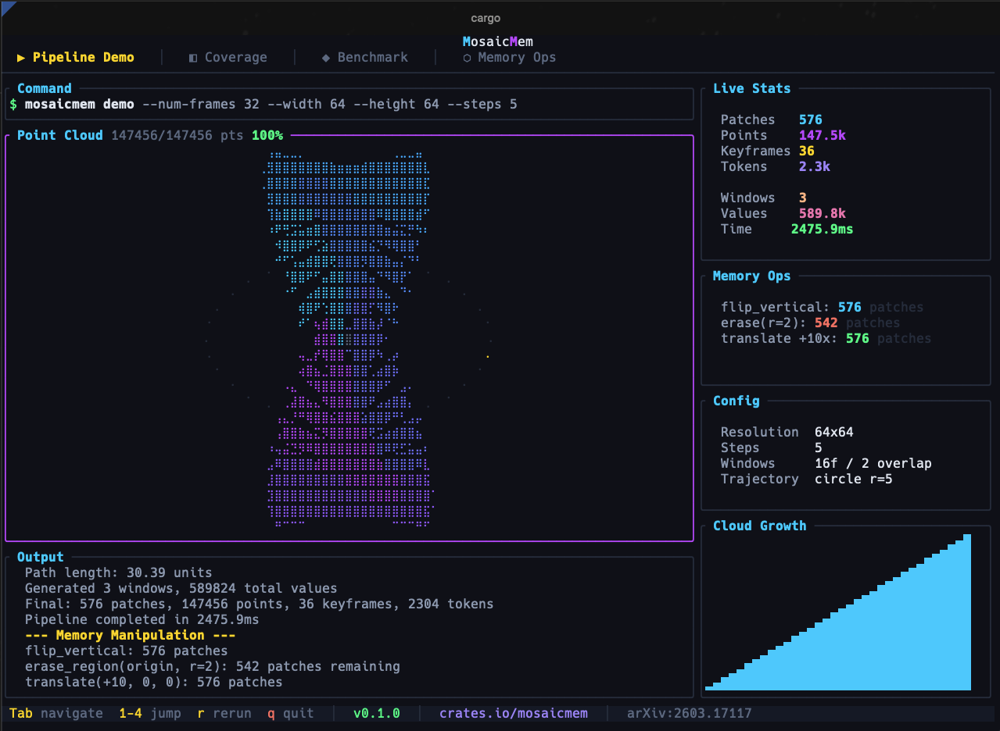
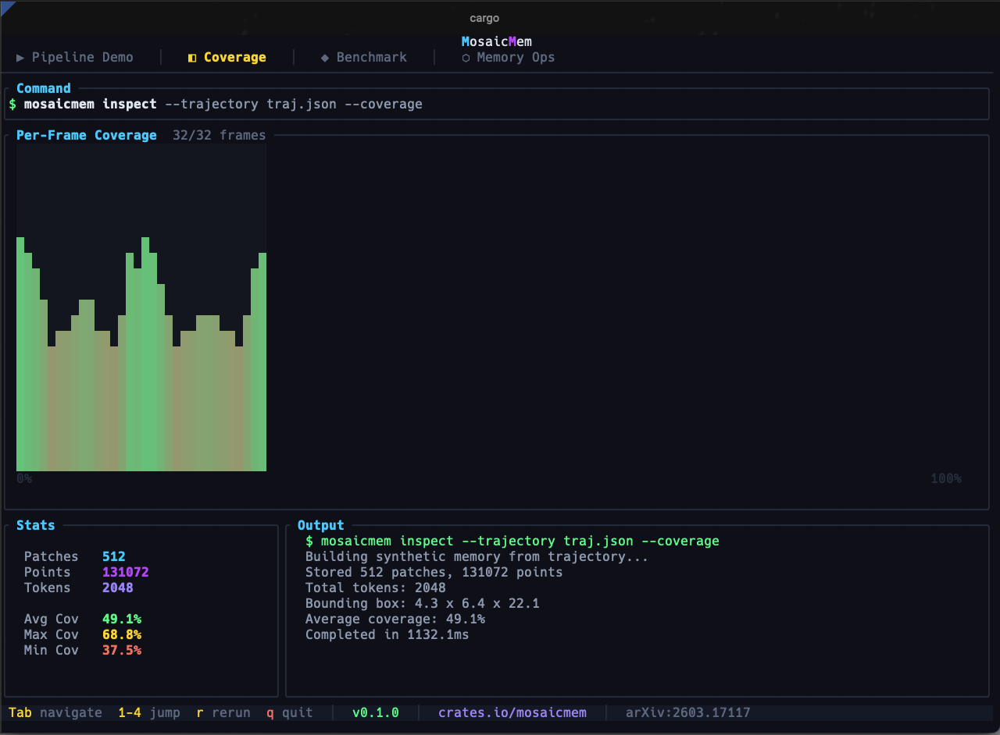
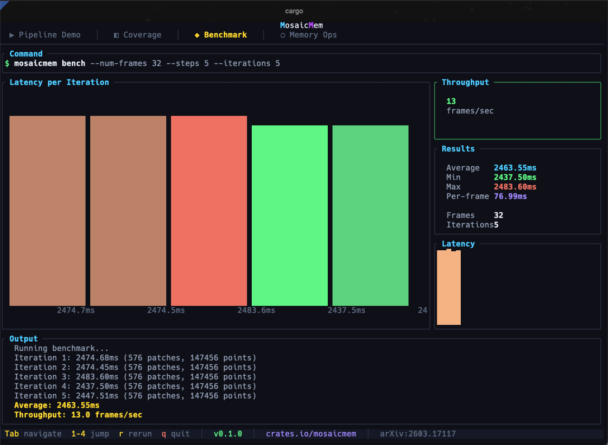
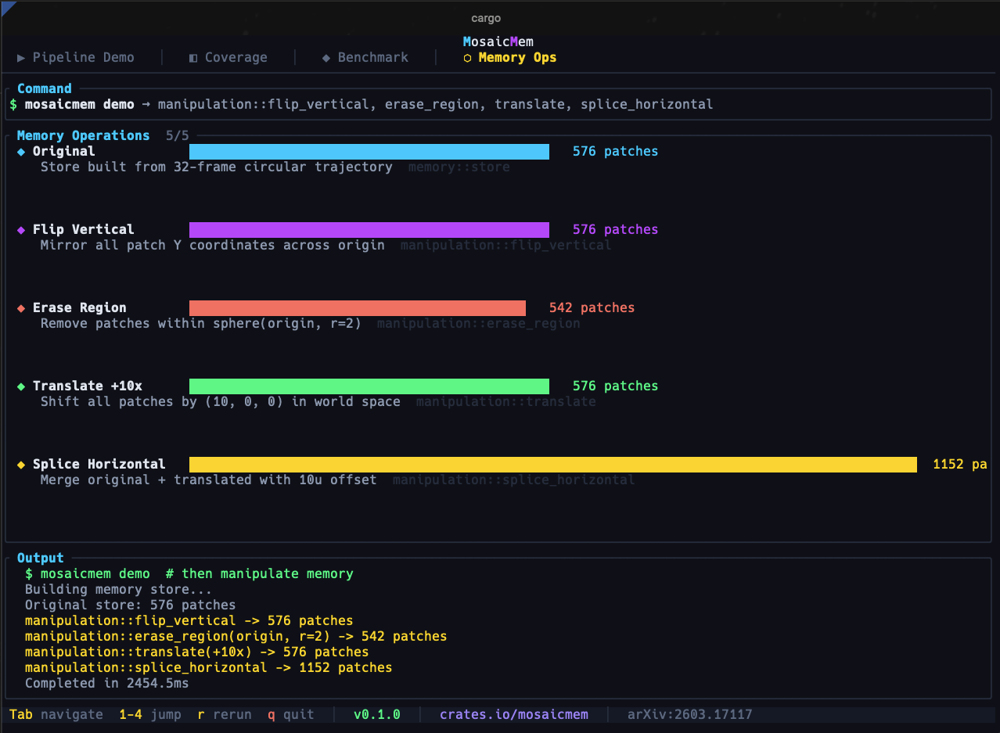

<p align="center">
  <h1 align="center">mosaicmem</h1>
  <p align="center">
    <strong>Hybrid Spatial Memory for Video World Models</strong>
  </p>
  <p align="center">
    Rust implementation of <a href="https://arxiv.org/abs/2603.17117">MosaicMem</a> &mdash; a 3D-aware memory architecture<br>
    that gives diffusion-based video generators persistent spatial understanding.
  </p>
</p>

<p align="center">
  <a href="https://crates.io/crates/mosaicmem"></a>
  <a href="https://docs.rs/mosaicmem"></a>
  <a href="LICENSE"></a>
</p>

---

## The Problem

Standard video diffusion models forget. Move the camera forward, turn around, and the scene behind you is gone. The model hallucinates a new one. MosaicMem fixes this by maintaining a **3D patch memory** that tracks what has been generated, where it was in the world, and how to retrieve it when the camera returns.

## Architecture

```
Trajectory ──▶ Keyframes ──▶ Depth ──▶ Fusion
[SE3 poses]                               │
                                          ▼
                                    Patch Memory
                                      (KD-tree)
                                          │
   Target Pose ──▶ Frustum Cull ──▶ Retrieve Top-K
                                          │
                 ┌────────────────────────┼────────────────────────┐
                 │                        │                        │
                 ▼                        ▼                        ▼
           Warped RoPE              Warped Latent            Coverage Mask
                 │                        │                        │
                 └────────────────────────┼────────────────────────┘
                                          │
                                          ▼
                  DiT Denoising (cross-attn + PRoPE)
                                          │
                                          ▼
                                     VAE Decode ──▶ Frames
```

## Quick Start

```bash
cargo add mosaicmem
```

Or from source:

```bash
git clone https://github.com/AbdelStark/mosaicmem.git
cd mosaicmem
cargo test
cargo run -- demo --num-frames 16 --width 64 --height 64 --steps 5
```

The demo writes synthetic frames, a point cloud, a trajectory file, and a serialized memory store to `demo_output/`.

## Core Concepts

### 1. Camera Trajectory

Everything starts with a sequence of SE3 camera poses. Each pose encodes where the camera is and which direction it faces, using a rigid-body transformation (rotation + translation) in world coordinates.

```rust
use mosaicmem::camera::{CameraPose, CameraTrajectory};
use nalgebra::{UnitQuaternion, Vector3};

// Build a trajectory: camera moves 0.5 units along X per frame
let poses: Vec<CameraPose> = (0..32)
    .map(|i| {
        CameraPose::from_translation_rotation(
            i as f64 * 0.033,  // timestamp (seconds)
            Vector3::new(i as f32 * 0.5, 0.0, 0.0),
            UnitQuaternion::identity(),
        )
    })
    .collect();

let trajectory = CameraTrajectory::new(poses);
```

Trajectories can be saved/loaded as JSON, enabling offline trajectory design and replay.

### 2. Depth Estimation & 3D Lifting

Keyframes are lifted into 3D using monocular depth. The `DepthEstimator` trait abstracts over backends &mdash; plug in your own ONNX model or use the included synthetic estimator for testing.

```rust
use mosaicmem::geometry::depth::{DepthEstimator, SyntheticDepthEstimator};

let depth = SyntheticDepthEstimator::new(5.0, 1.0); // base_depth, noise_scale
```

Depth maps are unprojected through camera intrinsics into world-space 3D points, then incrementally fused via `StreamingFusion` with voxel-based deduplication and a KD-tree for spatial queries.

### 3. Patch Memory Store

The core data structure. Stores 3D patches &mdash; each carrying a latent vector (from VAE encoding), its world-space center, source camera pose, and provenance metadata.

```rust
use mosaicmem::memory::store::{MosaicMemoryStore, MemoryConfig};

let config = MemoryConfig {
    max_patches: 4096,
    top_k: 64,
    near_clip: 0.1,
    far_clip: 100.0,
    patch_size: 16,
    latent_patch_size: 2,
    ..Default::default()
};

let store = MosaicMemoryStore::new(config);
```

**Retrieval** is the key operation: given a target camera pose, the store performs frustum culling, projects 3D patch centers into the target view, scores by visibility, and returns the top-K patches. Supports:

- **Temporal decay** &mdash; exponential half-life downweights stale patches
- **Diversity filtering** &mdash; penalizes spatially redundant patches in the target 2D view
- **Budget enforcement** &mdash; evicts lowest-scored patches when memory is full

The store is serializable to JSON for inspection and debugging.

### 4. Warped RoPE

Standard Rotary Position Embeddings (RoPE) assign positions on a fixed grid. Warped RoPE instead:

1. Takes each memory patch's 3D center
2. Reprojects it into the target camera's 2D coordinates
3. Computes a temporal offset `|t_source - t_target|`
4. Uses the warped `(u, v, t)` triple as RoPE positions

This ensures patches from different viewpoints and times appear at geometrically correct positions in the attention computation, rather than arbitrary grid slots.

### 5. PRoPE (Projective Rotary Position Embedding)

Camera-dependent positional encoding that goes beyond Plucker coordinates. PRoPE derives multiplicative rotation parameters from the camera's full projection geometry (intrinsics + extrinsics), giving the transformer direct access to the projective structure of each frame.

### 6. Warped Latent Alignment

Retrieved memory patches are geometrically aligned to the target view in feature space. A planar homography is computed from source-to-target camera geometry and applied to warp the patch's latent tensor, so the diffusion backbone sees memory features in the correct spatial position.

### 7. Memory Cross-Attention

Multi-head cross-attention where:
- **Queries** = current denoising tokens
- **Keys/Values** = retrieved memory patches + rasterized latent canvas

Keys are enhanced with Warped RoPE before the attention dot product. A learnable gate controls how much memory signal reaches the denoising stream, preventing catastrophic overwriting of novel content.

### 8. Autoregressive Rollout

Long videos are generated in overlapping windows. Each window:

1. Slices the trajectory into `window_size` poses
2. Retrieves the memory mosaic from the store
3. Runs the full DiT denoising loop (with memory conditioning)
4. Decodes latents through the VAE
5. Linearly blends overlap frames with the previous window
6. Inserts new keyframes back into memory

The stride between windows is `window_size - overlap`, giving smooth transitions without discontinuities.

## Library API

```rust
use mosaicmem::camera::{CameraPose, CameraTrajectory};
use mosaicmem::diffusion::backbone::SyntheticBackbone;
use mosaicmem::diffusion::scheduler::DDPMScheduler;
use mosaicmem::diffusion::vae::SyntheticVAE;
use mosaicmem::geometry::depth::SyntheticDepthEstimator;
use mosaicmem::pipeline::autoregressive::AutoregressivePipeline;
use mosaicmem::pipeline::config::PipelineConfig;

let config = PipelineConfig {
    width: 256,
    height: 256,
    window_size: 16,
    window_overlap: 4,
    num_inference_steps: 50,
    retrieval_top_k: 64,
    diversity_radius: 32.0,
    temporal_decay_half_life: 5.0,
    enable_warped_latent: true,
    ..Default::default()
};

let trajectory = CameraTrajectory::new(/* your poses */);
let backbone = SyntheticBackbone::new(0.1);
let scheduler = DDPMScheduler::linear(1000, 1e-4, 0.02);
let vae = SyntheticVAE::new(8, 4, 16);  // downsample, latent_ch, hidden
let depth = SyntheticDepthEstimator::new(5.0, 1.0);
let text_embedding = vec![vec![0.0f32; 64]; 10];

let mut pipeline = AutoregressivePipeline::new(config);
let (frames, shapes) = pipeline.generate(
    &trajectory, &text_embedding,
    &backbone, &scheduler, &vae, &depth,
    None,  // optional per-window callback
)?;
// frames: Vec<f32> in [B, C, T, H, W] layout per window
// shapes: Vec<[usize; 5]> — one shape per window
```

All model-dependent components are behind traits (`DiffusionBackbone`, `NoiseScheduler`, `VAE`, `DepthEstimator`), so you can swap synthetic backends for real inference engines.

## CLI

```
mosaicmem <COMMAND>

  generate     Generate video windows from a trajectory → PNGs
  visualize    Print trajectory statistics
  splice       Build stores from two trajectories and splice their patches
  inspect      Build a store and print memory/coverage statistics
  show-config  Print default or loaded pipeline configuration as JSON
  demo         Run the full synthetic end-to-end demo
  export-ply   Export a synthetic fused point cloud as PLY
  bench        Benchmark the synthetic pipeline
  tui          Launch the interactive terminal showcase
```

```bash
# Full demo with output artifacts
cargo run -- demo --num-frames 32 --width 128 --height 128 --steps 10

# Inspect default config
cargo run -- show-config

# Export point cloud
cargo run -- export-ply --num-frames 16
```

## Module Map

```
src/
├── camera/          Camera poses (SE3), intrinsics, trajectory I/O, keyframe selection
├── geometry/        Depth estimation, 3D projection, point clouds, streaming fusion
├── memory/          Patch store, frustum-culled retrieval, mosaic assembly, manipulation
├── attention/       RoPE, PRoPE, Warped RoPE, Warped Latent, memory cross-attention
├── diffusion/       Noise scheduler (DDPM), backbone trait, VAE trait
├── pipeline/        Single-window inference, autoregressive rollout, config
└── tui/             Interactive terminal showcase
```

## TUI Showcase

<table>
  <tr>
    <td width="50%" valign="top">
      
      <p><em>Pipeline Demo: run the end-to-end synthetic rollout and inspect generated artifacts from the terminal.</em></p>
    </td>
    <td width="50%" valign="top">
      
      <p><em>Coverage: visualize retrieval footprint and how much of the current view is grounded by memory.</em></p>
    </td>
  </tr>
  <tr>
    <td width="50%" valign="top">
      
      <p><em>Benchmark: inspect latency, throughput, and per-iteration pipeline statistics in one screen.</em></p>
    </td>
    <td width="50%" valign="top">
      
      <p><em>Memory Ops: exercise splice, erase, translate, and other patch-space manipulations interactively.</em></p>
    </td>
  </tr>
</table>

## Testing

120+ tests across unit, integration, and end-to-end coverage.

```bash
cargo test                                                 # all tests
cargo clippy --all-targets --all-features -- -D warnings   # lint
cargo run -- bench                                         # synthetic pipeline benchmarks
```

## Citation

```bibtex
@article{mosaicmem2026,
  title   = {MosaicMem: Hybrid Spatial Memory for Controllable Video World Models},
  author  = {Wei Yu and Runjia Qian and Yumeng Li and Liquan Wang and Songheng Yin and
             Sri Siddarth Chakaravarthy P and Dennis Anthony and Yang Ye and Yidi Li and
             Weiwei Wan and Animesh Garg},
  journal = {arXiv preprint arXiv:2603.17117},
  year    = {2026}
}
```

## License

[MIT](LICENSE)
